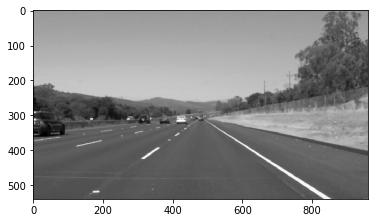
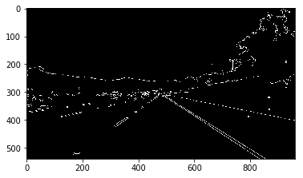
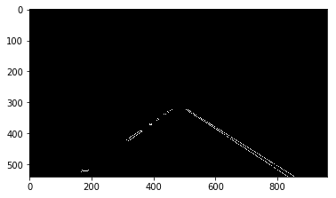
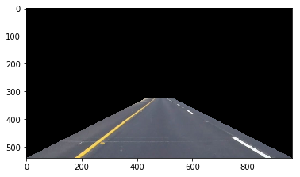
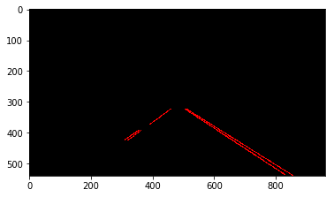
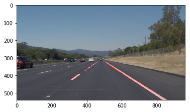

# **Finding Lane Lines on the Road** 

The goals / steps of this project are the following:  

* Make a pipeline that finds lane lines on the road
* Reflect on your work in a written report

---

### Reflection

### 1. Describe your pipeline. As part of the description, explain how you modified the draw_lines() function.

My pipeline consisted of 5 steps. First, I converted the images to grayscale:

Then I blurred the image with a small kernel for a smoother edge detection with the canny algorithm:

After that the canny edge detection algorithm is applied to transform the image to reveal the edges.

Because there are also edges in the landscape a mask is applied to the image. You can see how the mask would look like on the original image on the image below.

Now the hough transformation is used to extract the lines.

Finally the lane lines are overlayed on top of the original image.

In order to draw a single line on the left and right lanes, I modified the draw_lines() function by filtering the lines based on their slope. Right lines mus have a slope between 0.4 and 0.8 and left lanes between -0.4 and -0.8. Keep in mind that the origin is in the top left corner, so the slopes for the left lanes are negative. 

Then I calculated the intersection with the horizontal bottom- and middle line of the image and all extended left lines. Of all these intersections an average for the bottom intersection and middle intersection is calculated and used to draw one line for the left lane. The same is done for the right lane.

In the following image you can see the discarded (wrong slope) lines in red. The detected lines for the left lane are in green, for the right lane in yellow. The extrapolated left lane is a light blue and the corresponding right lane orange.

### 2. Identify potential shortcomings with your current pipeline

Most configuration values are hardcoded, the values for the canny and hough transformation and the shape of the applied mask. I'm pretty sure these configuration values are not working good if its dark or raining and the brightness of the street changes (as you can see in the challenge video). Also sharp turns could get masked out or parts of the street when the vehicle approaches a steep hill.

Also there is not any previous data used. So jumping detected lines from one position to another are possible right now, which would be impossible in the real world.

Right now detected lines are always straight. This doesn't apply to the real world as streets are bent quite a lot.

### 3. Suggest possible improvements to your pipeline

A possible improvement would be to normalize the image as one of the first steps, maybe even with a small kernel so local differences in brightness are smoothed. That may help with different bright street surfaces.

Previous data could be used to further smoothen the detected lines and verify correctness of detected lines. For example smoothing the results by using the average of the last three images or improve results by verifing that a detected line is close to a previous detected line.

Another potential improvement could be to fit a polygonal function to the detected points to allow to identify cureves.
